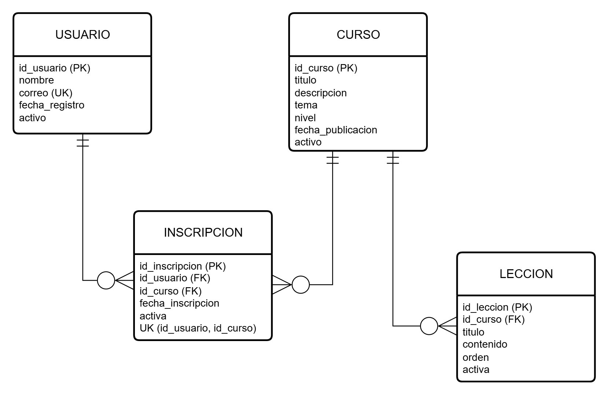

# EducaParaTodos

Proyecto académico de la asignatura **Desarrollo Web II de IPCHILE**, correspondiente a la evaluación del módulo 3, desarrollado por Gonzalo Tapia Vergara.

La propuesta consiste en desarrollar una plataforma web para una organización sin fines de lucro que ofrece cursos gratuitos a comunidades desfavorecidas. El sistema estará orientado al administrador y permitirá gestionar usuarios, cursos, lecciones e inscripciones.

## Objetivo

Aplicar los contenidos del curso mediante una aplicación web organizada en modelos, vistas y controladores, utilizando Java Persistence API (JPA) para el mapeo objeto-relacional y JPQL para las consultas y operaciones masivas.

## Modelo entidad-relación



El modelo relaciona usuarios y cursos mediante las inscripciones. Cada curso puede contener varias lecciones. Las columnas de estado permiten realizar bajas lógicas sin eliminar la información almacenada.

## Funcionalidades previstas

- Crear, consultar, editar, activar y desactivar usuarios y cursos.
- Corregir el nombre y el correo electrónico de los usuarios.
- Añadir y quitar inscripciones manualmente, incluyendo matrículas tardías.
- Organizar las lecciones de cada curso.
- Buscar cursos por tema, nivel de dificultad y popularidad.
- Ejecutar actualizaciones masivas y bajas lógicas de usuarios o cursos según criterios definidos.
- Incorporar páginas de inicio, búsqueda, perfil de usuario y detalle de curso.
- Adaptar las pantallas a dispositivos móviles y computadores.

La popularidad de cada curso se calculará a partir de sus inscripciones activas. El nivel del curso no se modificará después de su creación.

## Tecnologías propuestas

De acuerdo con los apuntes de la asignatura, se considera utilizar:

- Java y Servlets para procesar las solicitudes.
- JSP, HTML y CSS para las vistas.
- JPA para gestionar la persistencia.
- JPQL para consultar y modificar los datos.
- Git y GitHub para registrar el desarrollo.

El entorno inicial utiliza IntelliJ IDEA, JDK 21 con compilación para Java 17, Maven y Apache Tomcat 10.1.59. La persistencia se configurará con MariaDB mediante XAMPP.

## Desarrollo por etapas

1. Definir los requisitos y el alcance.
2. Preparar la estructura del proyecto y una primera página ejecutable.
3. Diseñar el modelo entidad-relación.
4. Crear la base de datos e implementar las entidades con JPA.
5. Desarrollar las operaciones CRUD de usuarios.
6. Desarrollar la gestión de cursos y lecciones.
7. Incorporar inscripciones y búsquedas con JPQL.
8. Implementar las operaciones masivas y bajas lógicas.
9. Revisar el diseño, probar el sistema y preparar la entrega.

## Base de datos

El proyecto utiliza MariaDB, incluida en XAMPP, con una base llamada `educaparatodos_gt` y codificación `utf8mb4`. El sufijo corresponde a las iniciales del autor y permite distinguirla de otras entregas. Su estructura está compuesta por cuatro tablas:

- `usuario`: datos personales, fecha de registro y estado.
- `curso`: información del curso, tema, nivel, fecha de publicación y estado.
- `leccion`: clases ordenadas que pertenecen a un curso.
- `inscripcion`: relación entre usuarios y cursos.

La base contiene 15 usuarios, 4 cursos, 12 lecciones y 24 inscripciones de prueba. Los estados permiten realizar bajas lógicas y la popularidad de los cursos se obtiene contando sus inscripciones activas.

El archivo `database/educaparatodos.sql` contiene la estructura y los datos iniciales. Al ejecutarlo, elimina y crea nuevamente la base `educaparatodos_gt` para restaurar su contenido original.

## Instalación y uso

### Preparar la base de datos

1. Iniciar Apache y MySQL desde el panel de XAMPP.
2. Abrir phpMyAdmin desde el botón **Admin** de MySQL.
3. Seleccionar **Importar**.
4. Elegir el archivo `database/educaparatodos.sql` y ejecutar la importación.

### Desde IntelliJ IDEA

1. Abrir el proyecto y cargar los cambios de Maven.
2. Seleccionar JDK 21 como SDK y como JRE del ejecutor de Maven.
3. En la ventana Maven, utilizar **Execute Maven Goal** y ejecutar `package cargo:run`.
4. Esperar el inicio de Tomcat y abrir <http://localhost:8080/educaparatodos/>.
5. Para detenerlo, pulsar Stop en la ejecución.

La primera ejecución requiere internet para descargar las herramientas y Tomcat. No hace falta instalar Tomcat por separado. Se utiliza el puerto 8080, que debe estar libre, y el servidor solo escucha en el equipo local.

Si Maven está instalado en la terminal, ejecutar:

```text
mvn package cargo:run
```

Después de modificar la página, detener y volver a ejecutar para reconstruirla. Los archivos generados quedan en `target/`, excluido de Git.

### Archivos iniciales

- `pom.xml`: compilación, empaquetado web e inicio de Tomcat.
- `src/main/webapp/index.jsp`: portada.
- `src/main/webapp/css/styles.css`: estilos adaptativos.
- `src/main/webapp/WEB-INF/web.xml`: página de inicio de la aplicación.
- `database/educaparatodos.sql`: estructura de la base de datos y datos de prueba.

## Documentación de entrega

La entrega incluirá el código fuente, el modelo entidad-relación, el script SQL con datos de prueba y las instrucciones necesarias para ejecutar el proyecto localmente.

## Material de referencia

- Enunciado de la evaluación EPE3.
- Apunte del módulo 1: Introducción a HTML5, CSS y GitHub.
- Apunte del módulo 2: Servlets, Java Beans y Java Persistence API.
- Apunte del módulo 3: Java Persistence API y patrón de arquitectura de software MVC.

- [Biblioteca_crud_test, de Sakhura](https://github.com/Sakhura/Biblioteca_crud_test): referencia conceptual para organizar el CRUD y sus pruebas.
- [EducaParaTodos de referencia, de Sakhura](https://github.com/Sakhura/educaParaTodos_ejemplo): orientación sobre el entorno web del módulo 3.
